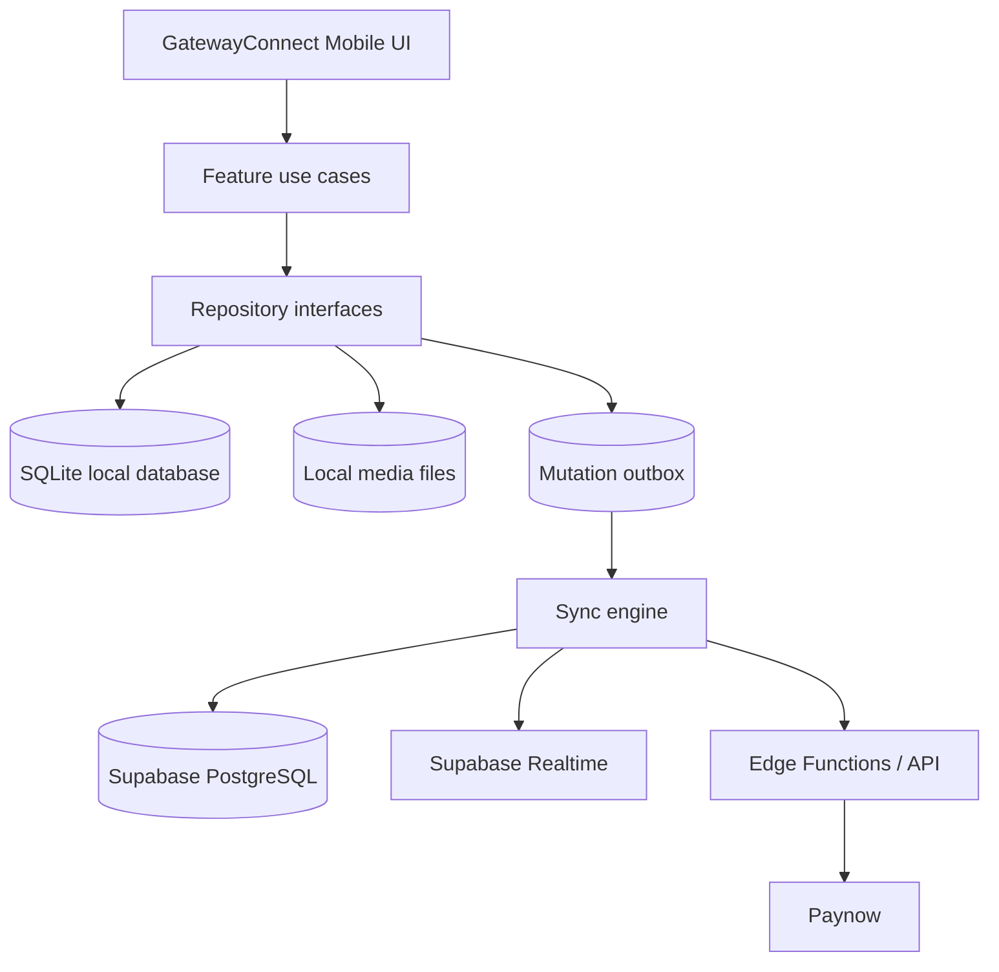

# GatewayConnect Mobile Architecture

## Decision

GatewayConnect will use an offline-first architecture:

- The mobile client owns the local user experience through a durable local database.
- Supabase remains the cloud source of truth for shared church data.
- An outbox queues local mutations until connectivity returns.
- Supabase Realtime updates the local database; screens do not consume realtime events directly.
- Payments, live streaming, presence, and booking confirmation remain online-only.

The existing Vite web app is the first client. Its browser storage services should be kept behind repository interfaces so a future React Native client can reuse the domain and sync layers.

## Target System



## Offline Capability Matrix

| Capability | Offline behavior | Sync rule |
|---|---|---|
| Bible reading/search | Fully available for installed packs | Content packs are versioned and downloaded explicitly |
| Bookmarks, highlights, notes | Read and write locally | Upsert by user and verse; preserve newer edits |
| Reading plans | Available locally | Latest progress timestamp wins |
| Downloaded devotionals | Available locally | Content is server-owned |
| Downloaded sermons | Playback only when the file is present | Download metadata is local |
| Feed and events | Show the last local snapshot | Server refreshes when online |
| Prayer requests/comments | Create drafts offline | Append-only upload with client IDs |
| Follows/reactions | Apply locally | Idempotent queued operations |
| Direct messages | View cached history and compose drafts | Send when online; delivery is server-authoritative |
| Live streams/presence | Disabled with a clear offline state | Reconnect when online |
| Payments/bookings | Disabled offline | Never report success without server confirmation |

## Local Data Model

The mobile implementation should use SQLite, preferably `expo-sqlite` with Drizzle migrations. Core tables:

```text
users, sermons, devotionals, events, products
community_posts, post_comments, prayer_requests
direct_messages, group_messages, notifications
bible_versions, bible_books, bible_chapters, bible_verses
bible_bookmarks, bible_highlights, bible_notes
reading_plans, reading_plan_progress
media_downloads, sync_outbox, sync_cursors, sync_tombstones
app_settings
```

Bible search should use SQLite FTS5. A translation or Shona Bible pack must be versioned, checksum-verified, and legally distributable before it is bundled or offered for download.

## Synchronization Contract

Every local mutation is applied immediately to the local database and also creates an outbox record:

```text
operation_id, entity_type, entity_id, operation, payload
created_at, attempt_count, last_error, status
```

The sync engine should:

1. Upload pending operations with an idempotency key.
2. Mark successful operations as synced.
3. Retry transient failures with backoff.
4. Retain permanent failures for manual retry.
5. Pull remote changes using per-table cursors.
6. Apply realtime events to local storage.
7. Record tombstones for deletes.

Conflict rules are feature-specific: append-only for messages/comments, union for highlights, latest timestamp for reading progress, and server-wins for products/events/payment state.

## Security Boundaries

- Store mobile sessions in secure storage, never ordinary app storage.
- Use Supabase Auth and Row Level Security based on the authenticated user.
- Keep Paynow integration keys in server-side functions only.
- Treat payment and booking status as server-authoritative.
- Replace the current permissive database policies before production mobile release.

## Implementation Phases

1. **Foundations**: Introduce repository interfaces, local database migrations, network monitoring, and the outbox.
2. **Offline Bible Storage**: Move Bible packs and search to local SQLite database storage.
3. **Sync Engine**: Add pull cursors, idempotent writes, retries, and conflict resolution via the outbox.
4. **Feeds & Content**: Cache feed, sermons, events, testimonies, and prayer requests.
5. **Media Management**: Add explicit media downloads and storage management.
6. **Payments**: Move all payment initiation and verification behind trusted server functions.
7. **React Native Shell**: Build the React Native app shell on top of the shared domain, repository, and sync contracts.
8. **Dynamic Events**: Implement dynamic events synced from Supabase to the mobile UI.
9. **Native Group Messaging**: (To Be Implemented)
10. **Advanced Bible Features**: Add support for Reading Plans, Highlights, Notes, and Bookmarks.
11. **Video Playback**: Expand the sermon media player to support native fullscreen video.
12. **Low-Data Mode & Analytics**: Add settings to disable automatic media downloads and track basic app usage.

## Current Repository Mapping

- **App Entry & UI Shell**: `App.tsx`
- **Local SQLite DB & Migrations**: `src/db/database.ts`, `src/db/migrations.ts`
- **Sync & Outbox**: `src/sync/syncEngine.ts`, `src/sync/outbox.ts`, `src/sync/syncStatus.ts`
- **Network State**: `src/network/networkStatus.ts`
- **Content & Feeds**: `src/data/contentRepository.ts`
- **Groups**: `src/data/groupRepository.ts`
- **Events**: `src/data/eventRepository.ts`
- **Bible Features**: `src/bible/bibleRepository.ts`, `src/bible/readingPlanRepository.ts`, `src/bible/suppliedBibleDatabase.ts`
- **Media & Downloads**: `src/media/downloadManager.ts`
- **User Authentication**: `src/auth/authService.ts`
- **Settings & Analytics**: `src/settings/settingsRepository.ts`, `src/analytics/analyticsService.ts`
- **Realtime Transport**: `src/remote/realtimeService.ts`
- **Cloud Schema**: `supabase/migrations/`
